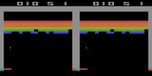

# SweetDreams

An Atari world model in two stages: a VQ-VAE tokenizer that compresses 84×84 RGB
frames into a grid of discrete tokens, and a GPT-style transformer that
autoregressively predicts the next frame's tokens conditioned on past
frame/action history. Trained on Breakout.

## Selected rollouts

Side-by-side videos. **Left = imagined rollout from the world model. Right =
ground-truth future frames.** Both sides share the same prompt frames *and* the
same injected action sequence at every step — only the dynamics differ
(imagined by the transformer vs. the real Atari emulator). Each loop pauses for
~3 seconds on the final frame before restarting. These are *selected* rollouts
(cherry-picked from a batch of samples); they are not representative
average-case behavior.




## Architecture

```
                                    ┌──────────────┐
   (frame_t, action_t) sequence ──▶ │  Tokenizer   │ ──▶ frame_t as 8×8 grid
   84×84 RGB                        │   (VQ-VAE)   │     of codebook indices
                                    └──────────────┘     (64 tokens / frame)
                                                                │
                                                                ▼
                                    ┌──────────────────────────────────┐
                                    │   World Model (GPT transformer)  │
                                    │                                  │
                                    │   interleaved token stream:      │
                                    │   [f_0 (64 tok), a_0 (1 tok),    │
                                    │    f_1 (64 tok), a_1 (1 tok),    │
                                    │    ...                       ]   │
                                    │                                  │
                                    │   → frame_logits over 512-entry  │
                                    │     codebook for each position   │
                                    └──────────────────────────────────┘
                                                                │
                                                                ▼
                                    ┌──────────────┐
                                    │  Tokenizer   │ ──▶ imagined 84×84 frame
                                    │   decoder    │
                                    └──────────────┘
```

### Stage 1 — Tokenizer (VQ-VAE)

Maps an 84×84×3 frame to an 8×8 grid of indices into a 512-entry codebook
(`latent_dim = 256`).

```
   84×84×3
      │
      ▼
   ┌────────────────────┐     Conv 4×4 s2 → GN → ReLU            (84 → 42)
   │      Encoder       │     Conv 4×4 s2 → GN → ReLU            (42 → 21)
   │                    │     SpatialSelfAttention (4 heads)
   │                    │     Conv 7×7 s2 → GN → ReLU            (21 →  8)
   │                    │     SpatialSelfAttention (4 heads)
   │                    │     Conv 3×3   → latent_dim=256
   └────────────────────┘
      │ z  (B, 256, 8, 8), L2-normalized along channel
      ▼
   ┌────────────────────┐
   │ VectorQuantizer    │     nearest L2 neighbor in 512-entry codebook
   │ (EMA, dead-code    │     EMA codebook updates with normalization
   │  restart, STE)     │     k-means init (40 iters, 20 batches)
   └────────────────────┘
      │ z_q  (B, 256, 8, 8)     +     indices  (B, 8, 8)
      ▼
   ┌────────────────────┐     Conv 3×3 → GN → SiLU
   │      Decoder       │     Conv 3×3 → GN → SiLU
   │                    │     SpatialSelfAttention
   │                    │     Upsample → Conv 3×3 → GN → SiLU    ( 8 → 21)
   │                    │     SpatialSelfAttention
   │                    │     Upsample → Conv 3×3 → GN → SiLU    (21 → 42)
   │                    │     Upsample → Conv 3×3 → Sigmoid      (42 → 84)
   └────────────────────┘
      │
      ▼
   reconstructed 84×84×3
```

Training objective:

```
L = L1(recon)  +  λ_perc · LPIPS(recon, target)  +  β · ||z - sg[z_q]||²
       └────────────┬────────────┘                   └─────────┬───────┘
            reconstruction                              commitment

    +  [optional GAN term — disabled in shipped tokenizer]
```

The codebook is updated by EMA (not gradient): exponential moving averages of
cluster counts and sums, with dead-code restarts replacing unused codes by
samples from the current batch.

#### GAN architecture (PatchGAN, **not used in the shipped tokenizer**)

The codebase includes a VQ-GAN-style adversarial path. **The shipped checkpoint
was trained with `discriminator.enabled: false`** — pure L1 + LPIPS + VQ losses.
The discriminator code is kept for future experiments.

```
   pred / real  (B, 3, 84, 84)
      │
      ▼
   ┌────────────────────────────────────────┐
   │  NLayerDiscriminator (PatchGAN)        │
   │                                        │
   │  Conv 4×4 s2          →  LReLU(0.2)    │  (84 → 42, no BN)
   │  Conv 4×4 s2 + BN     →  LReLU(0.2)    │  (42 → 21)
   │  Conv 4×4 s2 + BN     →  LReLU(0.2)    │  (21 → 10)   [num_layers = 3]
   │  Conv 4×4 s1 + BN     →  LReLU(0.2)    │  (stride 1, padded)
   │  Conv 4×4 s1          →  per-patch     │  → logits map
   │                          logits        │
   └────────────────────────────────────────┘
```

If enabled, the GAN path adds (after `disc_warmup_steps = 15000`):

- **Generator term:** `λ_g · hinge_g(D(recon))`, with `λ_g = disc_weight = 0.1`
  (optionally adaptively scaled by `||∇ L_nll|| / ||∇ L_g||` at the decoder's
  last conv, VQ-GAN style).
- **Discriminator term:** hinge loss `½(ReLU(1 − D(real)) + ReLU(1 + D(fake)))`
  plus an **R1 penalty** `½ · γ · E[||∇ D(real)||²]` with `γ = r1_weight = 10`.
- D is updated every `update_every = 4` generator steps with a separate Adam
  optimizer (`betas = (0.5, 0.9)`).

### Stage 2 — World Model (GPT)

Causal decoder-only transformer over the interleaved (frame-token, action)
stream.

```
   frame tokens  (B, T, N=64)          actions  (B, T-1)
        │                                   │
        ▼                                   ▼
   ┌─────────────────────────────────────────────────┐
   │  Embeddings                                     │
   │    frame_token  : Embedding(512, d=288)         │
   │    action       : Embedding(num_actions, d)     │
   │    spatial      : Embedding(N+1, d)             │
   │                    slots 0..N-1 = grid position │
   │                    slot   N     = action marker │
   │                                                 │
   │  interleave: [f_0(N), a_0, f_1(N), a_1, ...]    │
   │   length S = T · N + (T-1)                      │
   └─────────────────────────────────────────────────┘
        │
        ▼
   ┌─────────────────────────────────────────────────┐
   │  6 × TransformerBlock                           │
   │    LN → SelfAttention(causal, 4 heads)          │
   │         + RoPE on Q,K (temporal axis only)      │
   │         → +res                                  │
   │    LN → MLP (d → 4d → d, GELU) → +res           │
   │  LayerNorm                                      │
   └─────────────────────────────────────────────────┘
        │
        ▼
   ┌─────────────────────────────────────────────────┐
   │  Frame head: Linear(d→d) → ReLU → Linear(d→512) │
   └─────────────────────────────────────────────────┘
        │
        ▼
   frame_logits over the 512-entry codebook, per position
```

#### Positional encoding (hybrid: learned spatial + RoPE temporal)

Position is encoded along two independent axes, each with the tool that fits its
constraints:

- **Spatial** — a learned `Embedding(N+1, d)` added at the input. Slots `0..N-1`
  correspond to the `N = H·W = 64` grid positions within a frame; slot `N` is a
  shared marker added to every action token. The 8×8 grid is fixed and
  bounded, so learned embeddings can freely capture 2D structure that a
  flattened 1D RoPE would misrepresent as a 1D linear ordering.
- **Temporal** — 1D RoPE applied to Q and K inside attention (never V). All
  `N+1` tokens in one block (the 64 frame tokens of `f_t` plus the `a_t` that
  follows) share a single time index `t`. Same-frame attention (Δt = 0) gets
  RoPE identity → pure content dot, so within-frame spatial relationships flow
  entirely through the learned spatial embedding. Cross-frame attention
  encodes the integer temporal offset. RoPE is closed-form and KV-cache
  friendly — no embedding-table ceiling on rollout horizon.

See [src/world_model/RoPE.md](src/world_model/RoPE.md) for the RoPE math
derivation and a discussion of axial vs hybrid designs.

Config (see [configs/world_model.yaml](configs/world_model.yaml)):
`d_model = 288`, `num_layers = 6`, `num_heads = 4`, `dropout = 0.1`,
`tokens_per_frame = 64`, `seq_len = 16` past frames.

Rollout (see [src/world_model/generate.py](src/world_model/generate.py)) keeps a
sliding `(seq_len + 1)`-frame window. For each new frame, the 64 tokens are
sampled one at a time (top-k = 50, temperature = 1.0); the window then rolls
forward to admit the next action. No KV cache yet — each token re-runs the full
forward pass.

## Repo layout

```
configs/         vqvae.yaml, world_model.yaml (Hydra)
data/            collect.py, dataset.py, breakout.h5
src/
  tokenizer/     vqvae.py, discriminator.py, losses.py, metrics.py
  world_model/   world_model.py, transformer.py, embeddings.py, generate.py
train/           train_vqvae.py, train_world_model.py, utils.py
eval/            evaluation / FID / visualization scripts
weights/         tokenizer.pt, world_model.pt
demo/            selected rollout GIFs
```

## Training

```bash
# Stage 1 — tokenizer
python train/train_vqvae.py

# Stage 2 — world model (loads weights/tokenizer.pt)
python train/train_world_model.py

# Generate rollouts -> wandb video
python -m src.world_model.generate
```
